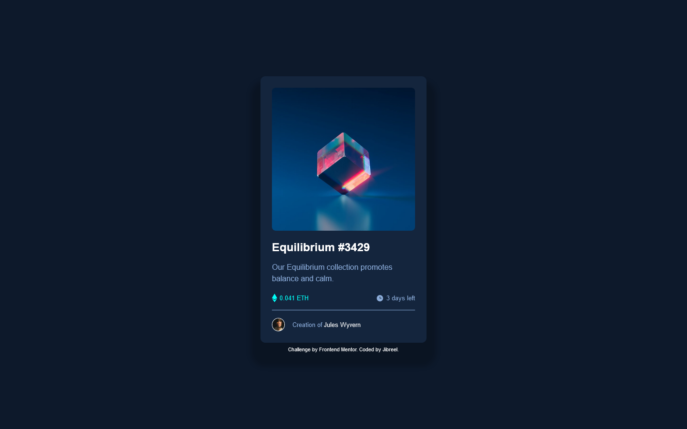

# Frontend Mentor - NFT preview card component solution

This is a solution to the [NFT preview card component challenge on Frontend Mentor](https://www.frontendmentor.io/challenges/nft-preview-card-component-SbdUL_w0U). Frontend Mentor challenges help you improve your coding skills by building realistic projects. 

## Table of contents

- [Overview](#overview)
  - [The challenge](#the-challenge)
  - [Screenshot](#screenshot)
- [My process](#my-process)
  - [Built with](#built-with)
  - [What I learned](#what-i-learned)
  - [Continued development](#continued-development)
  - [Useful resources](#useful-resources)
- [Author](#author)
- [Acknowledgments](#acknowledgments)

## Overview

### The challenge

Users should be able to:

- View the optimal layout depending on their device's screen size
- See hover states for interactive elements

### Screenshot

## My process

### Built with

- Semantic HTML5 markup
- CSS custom properties
- Flexbox
- CSS Grid
- Mobile-first workflow
- SCSS
- [Styled Components](https://styled-components.com/) - For styles

### What I learned

I used this project to practice SCSS I recently learnt. I really loved it. I learnt more about GRID and FLEX of CSS. I'mproudof myself for completing this project.

### Continued development

I will continue to practice and practice and practice. Before I started this project, I thought it will be an easy task for me, I found it otherwise. I will keep practicing!!

### Useful resources

- [w3schools](https://www.w3schools.com) - This website really helped me as a beginner. I have really improved, thanks to them.

## Author

-  Frontend Mentor - [@jibreel1](https://www.frontendmentor.io/profile/jibreel1)
-  Twitter - [@jibreel1005](https://www.twitter.com/jibreel1005)

## Acknowledgments

I'll like to thank the MAMIT team for their continous help and support towards this project and others I'll be doing in the future😉